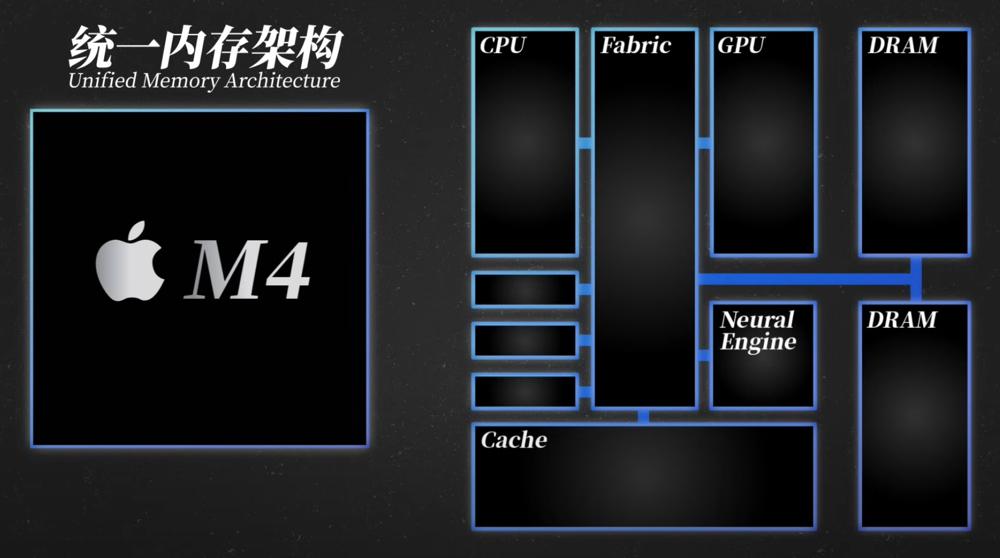
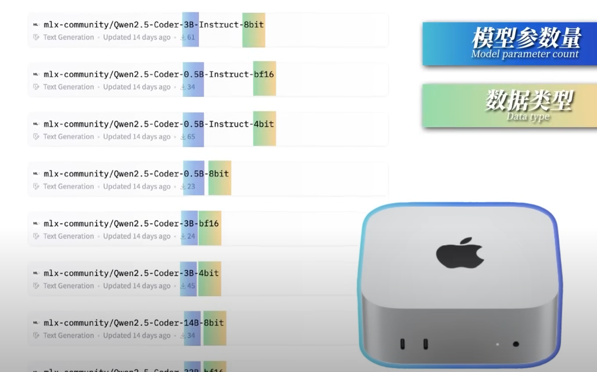

# CPU Architecture
## What CPU Architecture we have right now?
Traditional X86 Architecture -> Intel, AMD
ARM Architecture -> Apple M, Huawei Hislicon, TI TDAx family
RISC-V Architecture -> Tesla Dojo
MIPS Architecture 

## Cross-compiling
Why cross-compiling? 

Example of cross-compiling? 

How cross-compiling? (Best practice)

# TODO
GPU architecure -> Nvidia

TI’s TDAx family of SoCs is designed for ADAS applications, specifically the TDA4AP-Q1, TDA4VP-Q1, TDA4AH-Q1, and TDA4VH-Q1
    •	Real-time sensor data processing
	•	ISO26262 compliance up to ASIL D

Ethernet

CAN

ISO Communication Framework

Protokol (GVSP, TCP)

# Apple M chips architecture

RAM can be used as GPU-RAM? 

LLM running on Mac: 
https://www.youtube.com/watch?v=H-9j7f881ms
- Model Parameter
- Data type

TEST with chatbot (LM-studio)

why locally:
- quick
- data sensitive
- save energy 
